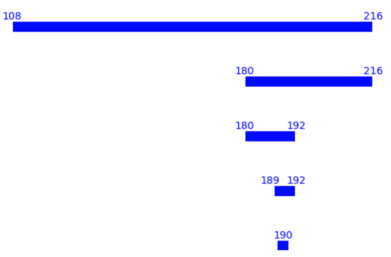

# AtCoder Beginner Contest 182 Tutorial

## Problem A - [twiblr](https://atcoder.jp/contests/abc182/tasks/abc182_a)

Just output $2A+100-B$. Time complexity is $\mathcal{O}(1)$.

::: details Code (Python 3)

<<<@/docs/tutorial/atcoder/ABC182/src/a.py

:::

## Problem B - [Almost GCD](https://atcoder.jp/contests/abc182/tasks/abc182_b)

Brute force. Time complexity is $\mathcal{O}(N\cdot\max(a))$.

::: details Code (Python 3)

<<<@/docs/tutorial/atcoder/ABC182/src/b.py

:::

## Problem C - [To 3](https://atcoder.jp/contests/abc182/tasks/abc182_c)

A number can be divided by $3$ if and only if the sum of its digits can be divided by $3$.

- $N\equiv0\mod 3$, no digits need to be removed.
- $N\equiv1\mod 3$, first try to delete one digit that $\equiv1\mod3$, then try to delete two digits that $\equiv2\mod3$.
- $N\equiv2\mod 3$, first try to delete one digit that $\equiv2\mod3$, then try to delete two digits that $\equiv1\mod3$.

Time complexity is $\mathcal{O}(\log N)$.

::: details Code (Python 3)

<<<@/docs/tutorial/atcoder/ABC182/src/c.py

:::

## Problem D - [Wandering](https://atcoder.jp/contests/abc182/tasks/abc182_d)

We can maintain the farthest position $ans$, the current position $pos$, the prefix sum $sum$, and the maximum of prefix sum $hi$.

In each round, we first update $sum$, then update $hi$. It is obvious that we can reach at most $pos+hi$ in this round, so we will use it to update $ans$, and then use $pos+sum$ to update $pos$.

Time complexity is $\mathcal{O}(N)$。

::: details Code (C++)

<<<@/docs/tutorial/atcoder/ABC182/src/d.cpp

:::

## Problem E - [Akari](https://atcoder.jp/contests/abc182/tasks/abc182_e)

Just put all the light bulbs and the walls into the matrix, then do a $4$-pass scan.

- For each row, from left to right.
- For each row, from right to left.
- For each column, from top to bottom.
- For each column, from bottom to top.

Time complexity is $\mathcal{O}(HW)$.

::: details Code (C++)

<<<@/docs/tutorial/atcoder/ABC182/src/e.cpp

:::

## Problem F - [Valid payments](https://atcoder.jp/contests/abc182/tasks/abc182_f)

Actually we need to find the number of tuples $\{k_i\}$ that satisfy

$$
\sum k_ia_i=x
$$

and

$$
\forall k_i, |k_ia_i| < a_{i+1}
$$

We can choose from left to right. It is easy to see that, we only need to store each state that can be reached, and the corresponding number of ways. We do not need to store the detailed coefficients.

Since $a_{i+1}$ is a multiple of $a_i$, so after we determine $k_i$, we need to ensure that the current sum can be divided by $a_{i+1}$. On the other hand, according to the constraint $|k_ia_i| < a_{i+1}$, we only have two choices for each state.

We start from $\{x,1\}$. It seems that there will be exponentional states, but actually, there are at most two states at any time. So the total time complexity is $\mathcal{O}(N)$.

### Example

$a=[1,3,12,36,108],\ x=190$

The states in each step are:

- $(190,1)\dots\text{original}$
- $(189,1),(192,1)$ 
- $(180,1),(192,2)$ 
- $(180,3),(216,2)$
- $(108,3),(216,5)$
- $(0,8)\dots\text{terminal}$

As we can see from the example, after each step, all states must be divided by $a_{i+1}$ (for the last step, the only valid state is $0$). Also, the states cannot change more than $a_{i+1}$, e.g., in the first step, we can only go from $190$ to $189$ or $192$, which are the nearest number that can be divided by $a_1=3$ to the left and to the right. We cannot go any further because that means we will go more than $3$, and thus violates the rule that both people use the minimum number of coins (because we can use the $3$-Yen coin instead of the $1$-Yen coin).

We can also see that, the span is either $0$ or exactly $a_{i+1}$ for each step.

::: details Code (C++)

<<<@/docs/tutorial/atcoder/ABC182/src/f.cpp

:::

<Utterances />
